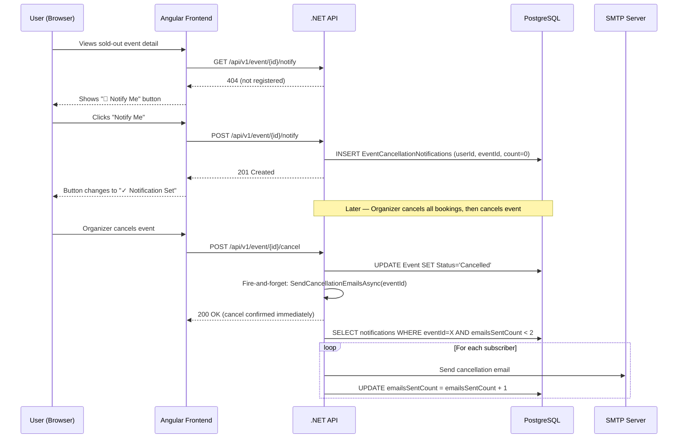

# Event Cancellation Notification ("Notify Me") Feature

## Background

Users browsing a sold-out published event currently see no way to express interest or get notified if anything changes. This feature adds a **"Notify Me on Cancellation"** button that appears when an event is fully sold out. The subscription is stored in a new database table, and when an organizer/admin cancels the event, the backend automatically emails every subscribed user (with a hard cap of **2 emails per user per event**).

---

## Key Design Decisions

> [!IMPORTANT]
> **No email service exists in the codebase today.** `ForgotPassword` currently returns the reset token directly in the API response. The email infrastructure must be built from scratch as part of this feature.

> [!NOTE]
> **The current `EventService.Cancel()` has a blocker**: it throws a `ValidationException` if **any** non-cancelled booking exists. In practice, an organizer must cancel all bookings manually before cancelling the event. The email notifications will fire immediately after `Status = "Cancelled"` is set, which happens at the end of that flow.

> [!NOTE]
> **"Sold Out" detection approach**: Rather than loading all ticket types on the event detail intro step (they are currently loaded lazily after screening selection), a computed `bool IsSoldOut` field will be added to `EventDto` by the backend. This keeps the frontend simple.

---

## Proposed Changes

---

### Layer 1 — Model (`EMSModelLibrary`)

#### [NEW] `EventCancellationNotification.cs`

New entity class with the following properties:

| Property | Type | Notes |
|---|---|---|
| `Id` | `int` | PK |
| `UserId` | `int` | FK → `User` |
| `EventId` | `int` | FK → `Event` |
| `EmailsSentCount` | `int` | Default `0`. Tracks how many cancellation emails have been sent to this user for this event. Capped at 2. |
| `CreatedAt` | `DateTime` | UTC, auto-set |
| `User` | `User` | Navigation property |
| `Event` | `Event` | Navigation property |

A **unique composite index** on `(UserId, EventId)` to prevent duplicate registrations.

#### [MODIFY] `EventDto` (in existing DTOs)

Add one new computed field:
```csharp
bool IsSoldOut  // true if ALL ticket types across ALL screenings for this event have AvailableQuantity == 0
```

---

### Layer 2 — Data Access (`EMSDALLibrary`)

#### [NEW] `IEventCancellationNotificationRepository.cs`

```csharp
Task<EventCancellationNotification?> GetByUserAndEvent(int userId, int eventId);
Task<List<EventCancellationNotification>> GetByEventId(int eventId);
// Add() and Update() come from AbstractRepository<T>
```

#### [NEW] `EventCancellationNotificationRepository.cs`

Extends `AbstractRepository<EventCancellationNotification>`. Implements the two methods above using EF Core + `Include(n => n.User)` for `GetByEventId` (needed to access user email when sending).

#### [MODIFY] `EventContext.cs`

Add:
```csharp
DbSet<EventCancellationNotification> EventCancellationNotifications
```

Configure in `OnModelCreating`:
- Unique index on `(UserId, EventId)`
- Cascade delete on `UserId` and `EventId`

#### [NEW] Migration

New EF Core migration: `AddEventCancellationNotifications`
- Creates `EventCancellationNotifications` table
- Adds the composite unique index

---

### Layer 3 — Business Logic (`EMSBLLLibrary`)

#### [NEW] `IEmailService.cs`

```csharp
public interface IEmailService
{
    Task SendAsync(string toEmail, string toName, string subject, string htmlBody);
}
```

#### [NEW] `SmtpEmailService.cs`

Implementation using **MailKit** (NuGet: `MailKit`). Reads SMTP configuration from `IConfiguration`:
- `Email:SmtpHost`
- `Email:SmtpPort`
- `Email:SmtpUser`
- `Email:SmtpPassword`
- `Email:FromAddress`
- `Email:FromName`

#### [NEW] `IEventNotificationService.cs`

```csharp
public interface IEventNotificationService
{
    // Register current user for cancellation notification on this event
    Task<EventCancellationNotificationDto> Register(int userId, int eventId);

    // Unregister (optional, allows user to cancel subscription)
    Task Unregister(int userId, int eventId);

    // Get registration status for current user (null = not registered)
    Task<EventCancellationNotificationDto?> GetStatus(int userId, int eventId);

    // Called internally by EventService.Cancel() — sends emails to all eligible subscribers
    Task SendCancellationEmailsAsync(int eventId, string eventTitle);
}
```

#### [NEW] `EventNotificationService.cs`

Key logic:

**`Register()`**:
1. Load event — throw `NotFoundException` if not found
2. Throw `ValidationException` if event is not `Published` (only subscribe to live events)
3. Check if a registration already exists for `(userId, eventId)` — if so, return it (idempotent)
4. Create and save new `EventCancellationNotification` with `EmailsSentCount = 0`

**`SendCancellationEmailsAsync()`**:
1. Load all `EventCancellationNotification` records for `eventId` where `EmailsSentCount < 2`, including the `User` navigation property
2. For each record:
   - Compose a cancellation email (HTML body with event title, apology message, and booking portal link)
   - Call `_emailService.SendAsync(user.Email, user.Name, subject, html)`
   - Increment `EmailsSentCount`
   - Save changes
3. Log how many emails were sent

**Email cap rule**: Only users with `EmailsSentCount < 2` receive the email. After sending, their count is incremented. If `EmailsSentCount` reaches 2, they are permanently excluded from future sends for this event.

#### [MODIFY] `EventService.cs` — `Cancel()` method

After `event.Status = "Cancelled"` and before `SaveChangesAsync()`:

```csharp
// Existing logic sets status = Cancelled...
await _repo.Update(ev);
// NEW: trigger cancellation emails (fire and don't await to not block the response)
_ = Task.Run(() => _notificationService.SendCancellationEmailsAsync(ev.Id, ev.Title));
```

> [!NOTE]
> Using `Task.Run` (fire-and-forget) ensures the cancel API responds immediately to the organizer. Email sending happens in the background. For production, a proper background job queue (e.g., Hangfire) would be preferred, but fire-and-forget is acceptable for the scope of this feature.

#### [MODIFY] `EventService.cs` — `MapToDto()` / response mapping

When mapping `Event` → `EventDto`, compute `IsSoldOut`:
- Query all `TicketType` records across all `Screenings` for the event
- `IsSoldOut = ticketTypes.Any() && ticketTypes.All(t => t.AvailableQuantity == 0)`

---

### Layer 4 — Application Layer (`EMSApplicationLayer`)

#### [NEW] `EventNotificationController.cs`

Base route: `api/v1/event/{eventId}/notify`

| Method | Route | Auth | Description |
|---|---|---|---|
| `POST` | `/api/v1/event/{eventId}/notify` | Authenticated User | Register current user for cancellation notifications on this event. Returns `201 Created` with the notification record. Idempotent — returns existing record if already registered. |
| `DELETE` | `/api/v1/event/{eventId}/notify` | Authenticated User | Unregister the current user from notifications for this event. |
| `GET` | `/api/v1/event/{eventId}/notify` | Authenticated User | Returns the notification registration for the current user, or `404` if not registered. Used by the frontend to show the correct button state on load. |

#### [MODIFY] `Program.cs`

Register new services:
```csharp
builder.Services.AddScoped<IEventCancellationNotificationRepository, EventCancellationNotificationRepository>();
builder.Services.AddScoped<IEventNotificationService, EventNotificationService>();
builder.Services.AddScoped<IEmailService, SmtpEmailService>();
```

#### [MODIFY] `appsettings.json`

Add a new `Email` section (values filled via user secrets in dev):
```json
"Email": {
  "SmtpHost": "",
  "SmtpPort": 587,
  "SmtpUser": "",
  "SmtpPassword": "",
  "FromAddress": "",
  "FromName": "Event Management System"
}
```

User secrets for local dev:
```
dotnet user-secrets set "Email:SmtpHost" "smtp.gmail.com"
dotnet user-secrets set "Email:SmtpPort" "587"
dotnet user-secrets set "Email:SmtpUser" "your@gmail.com"
dotnet user-secrets set "Email:SmtpPassword" "your-app-password"
dotnet user-secrets set "Email:FromAddress" "your@gmail.com"
```

#### [MODIFY] `EMSApplicationLayer.csproj`

Add NuGet package:
```xml
<PackageReference Include="MailKit" Version="4.x.x" />
```

---

### Layer 5 — Frontend (`EMSAngular`)

#### [NEW] Model type — `event-notification.model.ts`

```typescript
export interface EventCancellationNotificationDto {
  id: number;
  userId: number;
  eventId: number;
  emailsSentCount: number;
  createdAt: string;
}
```

#### [MODIFY] `event.model.ts`

Add to `EventDto`:
```typescript
isSoldOut: boolean;
```

#### [NEW] `event-notification.service.ts` (in `core/services/`)

```typescript
@Injectable({ providedIn: 'root' })
export class EventNotificationService {
  private base = (eventId: number) => `api/v1/event/${eventId}/notify`;

  register(eventId: number): Observable<EventCancellationNotificationDto>
  unregister(eventId: number): Observable<void>
  getStatus(eventId: number): Observable<EventCancellationNotificationDto | null> // 404 → null
}
```

#### [MODIFY] `event-detail.component.ts`

**New signals:**
```typescript
isNotified = signal(false);
notificationLoading = signal(false);
```

**In `ngOnInit()`** (after event is loaded, if user is authenticated):
- Call `eventNotificationService.getStatus(event.id)` → set `isNotified`

**New method `toggleNotification()`**:
- If `isNotified()` → call `unregister()`, set `isNotified(false)`, show toast "Notification removed"
- If `!isNotified()` → call `register()`, set `isNotified(true)`, show toast "You'll be notified if this event is cancelled"

**Template change on the intro step** — replace/augment the `[Proceed to Book]` button:

```
IF event.isSoldOut AND user is authenticated:
  → Show "🔔 Notify Me on Cancellation" button (if !isNotified)
  → Show "✓ Notification Set" button (disabled, success style) (if isNotified)
ELSE IF event.isSoldOut AND user is NOT authenticated:
  → Show "Log in to get notified" link → navigates to /auth/login
ELSE (not sold out):
  → Show existing "Proceed to Book" button as normal
```

#### [MODIFY] `event-card.component.html`

Add a **"SOLD OUT"** badge when `event.isSoldOut` is true:
```html
@if (event.isSoldOut) {
  <span class="sold-out-badge">Sold Out</span>
}
```

---

## Data Flow Summary



---

## Verification Plan

### Automated Tests (New)
- `EventNotificationServiceTests.cs`:
  - `Register_WhenNotRegistered_CreatesRecord`
  - `Register_WhenAlreadyRegistered_IsIdempotent`
  - `Register_WhenEventNotPublished_ThrowsValidationException`
  - `SendCancellationEmails_SendsToEligibleOnly_SkipsWhenCountAtLimit`
  - `SendCancellationEmails_IncrementsCount`
- `EventNotificationControllerTests.cs`: endpoint smoke tests

### Manual Verification
1. Set up SMTP credentials (Gmail app password recommended for dev)
2. Create and publish an event, sell all tickets
3. Navigate to the event detail → confirm "Notify Me" button appears
4. Click "Notify Me" → confirm button changes to "✓ Notification Set"
5. Cancel all bookings for the event (organizer dashboard)
6. Cancel the event → confirm 200 OK response
7. Check inbox → cancellation email received
8. Cancel the event a 2nd time (or trigger `SendCancellationEmailsAsync` again in tests) → confirm a 2nd email is sent
9. Confirm 3rd trigger does NOT send email (count = 2, limit reached)
10. Verify "SOLD OUT" badge appears on event cards
